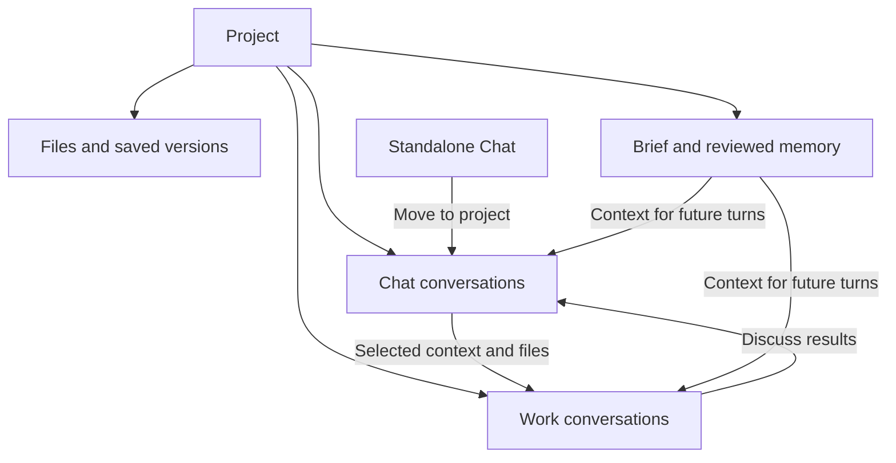

# Projects, Chat, Work, and shared memory

Implementation draft · 11 September 2026 · Source baseline: `22efa11`

**Recommendation:** make Project the shared home for Chat, Work, Files, and Memory. Extend the existing memory engine and file catalog. Keep standalone Chat available.

This document plans the next implementation. The current code change only fixes Chat’s sidebar style and icon. It adds no hierarchy, memory behavior, or backend routes.

## 1. What the user should experience

A proposal can start as a standalone Chat. Efran can attach it to a Project, save its brief, and continue through another account. A Work conversation can use the same approved brief and a selected document version. Its outputs return to the Project’s Files view.

| Area | Purpose | Existing behavior to preserve |
| --- | --- | --- |
| Chat | Discussion, document creation, and file revision | Managed working directory; provider, model, effort, and account controls |
| Work | Execution inside a configured workspace | Existing project conversations, CLI sessions, repository access, and execution controls |
| Files | Project documents and linked outputs | Immutable versions, downloads, previews, original retention, and provenance |
| Memory | Brief, decisions, facts, preferences, and proposals | Reviewed context, source links, revisions, exclusions, and token budgets |

Project membership shares context explicitly. It does not grant a Chat the Work directory, copy account credentials, or merge provider transcripts.

## 2. UI and routes

Project navigation contains four tabs: **Chat · Work · Files · Memory**. The header shows the project name, current activity, and actions for settings or archiving. Use the same navigation components and icons throughout.

| Destination | Route | Behavior |
| --- | --- | --- |
| Project list | `/projects` | Create, search, rename, archive, and restore projects |
| Project home | `/projects/:id` | Redirect to its Chat tab |
| Project tabs | `/projects/:id/chat`, `/work`, `/files`, `/memory` | The latter paths extend `/projects/:id` |
| Project settings | `/projects/:id/settings` | Workspace, defaults, required tools, and memory settings |
| All Chat | `/chat` | Existing home; filter standalone chats or a selected project |
| Chat conversation | `/chat/:chatId` | Preserve deployed links; show project breadcrumb when assigned |
| All Work | `/work` | Existing Control room behavior; keep `/` working as a compatibility entry |
| Work conversation | `/work/:projectId/:sessionId` | Open the exact conversation without relying on a server-wide selection |

Use anchors for navigation, including new-tab behavior. Preserve Back/Forward, refresh, and sign-in return destinations. Browser storage must keep drafts and attachments keyed to conversation identity. Project membership must not become part of that storage key.

The Project Chat tab offers **New chat** and **Add existing chat**. Standalone Chat offers **Move to project** and **Remove from project**. The Work tab offers **New work** after workspace setup. A project without a workspace shows a setup action and cannot launch Work accidentally.

Files show project documents and linked Chat/Work outputs with distinct source labels. Memory opens with the brief, confirmed entries, and a count of proposals awaiting review. A composer control shows **Using project memory**, with included entries and exclusions available to inspect.

On mobile, project navigation becomes a drawer. Dialogs keep their close control and primary action visible while lists scroll. Cover empty projects, missing links, archived projects, loading failures, and unavailable tools.

## 3. Data model and compatibility

Reuse ordinary Project records as the shared parent. Keep their IDs. Existing Work conversations remain in their original Project record.

| Record | Planned change |
| --- | --- |
| Ordinary Project | Add revision and mode-specific defaults. Allow a project without a configured Work directory. |
| Chat record | Add optional `parentProjectId` and `membershipRevision`. Keep `kind: chat`, its ID, session, and managed directory. |
| Work conversation | Keep current session and provider IDs. Treat legacy conversations as Work. |
| File catalog | Support project-owned files alongside existing chat-owned files. Preserve existing IDs and version references. |
| Memory context | Resolve the execution identity, parent project, membership revision, and conversation separately. |

An ordinary Project cannot have a parent. A Chat can have one ordinary parent or remain standalone. Reject cycles, Chat-as-parent, missing parents, and assignment to archived projects.

The current `Project.cwd` is required throughout the runtime. Making it optional requires an audit of every launch, history, discovery, memory import, and workspace operation. Introduce a validated runnable Work type. Never substitute the gateway directory when a workspace is missing.

Do not rename or relocate existing Chat directories. Do not rewrite session IDs, provider IDs, file URLs, queues, artifacts, or citations to introduce membership.

Keep legacy `/api/projects` responses usable by the current engine. Add an aggregate project view that excludes internal Chat records from the parent list. Do not silently redefine existing MCP `projectId` arguments: they identify execution targets today.

## 4. Shared memory behavior

Reuse `MemoryStore`, its review UI, and the existing MCP memory tools. The project brief is a pinned, reviewed `context` entry tagged `project-brief`. Its revisions and sources use the same storage as other memory.

| Source | Automatic context eligibility |
| --- | --- |
| Conversation memory | This conversation only |
| Existing Chat-local project memory | This Chat only, including after assignment to a parent |
| Parent project memory | Member Chat and Work conversations |
| Explicitly shared memory | Only the named recipient projects and their eligible members |
| Global memory | Preserve current settings and conversation exclusions |
| Referenced conversation | Reading or referencing it does not inherit its entire project memory |

Adding a Chat to a Project must not publish its old local memory to every sibling. **Share with project** is a separate, visible operation. Suggestions from an agent remain proposed until reviewed. Manual operator edits retain the existing confirmation behavior.

Use one context resolver for turn preparation, preview, MCP search/read, and source visibility. Resolve the parent on the server. A client-supplied parent ID cannot widen the context scope.

Context selection must preserve confirmed status, provider restrictions, expiry, superseded entries, source exclusions, and explicit sharing. Apply local exclusions before pins. Deduplicate by entry ID and revision. Keep one total budget; inherited context must not multiply the current limits. Current defaults are 2,400 estimated tokens and 12 entries.

Parent inheritance is within the same project. It must still work when cross-project retrieval is disabled. Explicit sharing with another project continues to respect that setting.

Memory remains reference material. Current user instructions take precedence. Show conflicting decisions for review rather than silently choosing a new truth. Preserve the current slash-command behavior, which bypasses automatic memory injection.

Record the context used at dispatch: entry IDs and revisions, sources, inclusion reasons, skipped reasons, and the membership revision. Capture it once for a turn. Same-provider account failover uses that same snapshot. New turns see later approved changes.

Build the preview from the same resolver. Label it as a preview until dispatch. A changed brief or membership can alter the final snapshot. If memory is unavailable, retain the current visible warning behavior. Never fall back to an unscoped search.

Source ingestion needs a parent-level view over its Work and member Chat conversations. Keep stable source keys, hashes, exclusions, redaction, bounded reads, and pagination. Avoid indexing full transcripts on every send. Derived summaries must retain their source versions.

## 5. Files remain the priority

Extend the existing file/version catalog and artifact storage. Add an owner resolver for `chat` and `project`; keep existing Chat endpoints as compatibility wrappers. Project storage must use manager-created directories under state.

**Add to project** creates a project file from a selected saved version. Retain its source file/version provenance. Reuse the immutable blob where possible, but give the project copy its own lineage. Later private Chat edits must not replace the project document silently.

A Chat or Work conversation can attach a project file version. At dispatch, resolve the saved bytes and create a writable checkout for that execution. Commit through the same expected-base and operation-ID checks. Concurrent edits must produce a conflict, never an unnoticed overwrite.

| Requirement | Build rule |
| --- | --- |
| Originals and versions | Preserve source bytes; restore creates a new version |
| Uploads | Keep streaming, progress, cancellation, retry, and current file/batch limits |
| Queued attachments | Persist file/version references, never browser-only blobs |
| Downloads | Preserve authentication, byte ranges, MIME handling, and Unicode filenames |
| Preview | Reuse persistent jobs and content-hash caching; a preview failure must leave download available |
| DOCX edits | Preserve document fidelity and reject unsupported edits with a reason |
| Work outputs | Import selected outputs into retained storage; do not expose arbitrary repository paths |
| Removal | Hide a document without breaking historical message references |
| Recovery | Fence stale workers, reconcile interrupted commits, and preserve idempotency |

Shared-file removal, membership changes, and cached checkouts need separate handling. Revalidate access at dispatch and commit. An old checkout must not gain access through a new parent. A membership change invalidates outstanding shared-file write leases.

Shared-file leases must identify the execution, run attempt, owner, membership revision, and base version. Fence the failed execution attempt, not the whole Project. One conversation’s account failover must not invalidate another conversation’s valid checkout. Version conflicts still resolve per file.

Keep format support explicit: DOCX inspection, supported editing, and preview; PDF preview; native image and text preview; retained downloads for other formats. Editing spreadsheets or presentations depends on a verified available tool. Do not claim universal Office editing.

File source text can support a memory proposal. Uploading a file must not automatically turn its contents into confirmed memory.

## 6. Chat and Work handoffs

**Continue in Work** creates a Work conversation inside the same Project. Require a configured workspace first. Present an editable task brief, selected source references, and exact file versions. The user chooses provider, model, effort, and account before sending.

**Discuss in Chat** creates or selects a Chat and carries selected results through the same handoff format. The payload includes an operation ID, source and target identities, selected memory revisions, and file references.

Retrying a handoff must reuse its target and avoid sending the first message twice. Reuse the delivery ledger and queue. Do not copy hidden provider state or claim native resume across providers. An explicit handoff can start a new conversation on another provider.

Reading, referencing, and messaging existing conversations remain available across projects. Preserve `send_message` approval, sender attribution, correlated replies, cancellation, and hop limits. Project membership does not bypass messaging approval.

## 7. Controls and related features

| Area | Plan |
| --- | --- |
| Provider/model/effort | Separate defaults for new Chat and new Work. Preserve existing conversation selections. |
| Accounts | Preserve locks, automatic selection, quota handling, reserves, and same-provider continuity. |
| Plugins, MCP, skills | Keep account-specific discovery and authorization. Add optional project requirements plus conversation requirements. |
| Required tools | Compute effective requirements at dispatch and before failover. Report missing authorization or incompatible versions before routing. |
| Capability refresh | Preserve active turns and waiting messages. An installed but unverified plugin cannot satisfy a required tool. |
| Search | Add parent and mode filters; group results by Project, then Chat or Work. Keep standalone results visible. |
| Activity | Aggregate running, background, waiting, and needs-input states without hiding individual conversations. |
| Costs | Group Chat and Work costs under the parent while retaining account and conversation detail. |
| Queue and Automations | Preserve target IDs, ordering, timing, approvals, retries, and provider preferences. |
| Notifications and links | Resolve the exact conversation from notifications, pinned items, source citations, and browser history. |
| Project settings | Keep workspace setup, defaults, tool requirements, and memory controls together. |

Discover tools using the target execution’s actual directory and account. A repository-only skill in Work must not appear ready in Chat merely because they share a Project.

Project requirements are task settings; account credentials remain outside the Project. Do not create a second plugin manager, memory database, artifact library, scheduler, or task system.

## 8. Membership, archive, and recovery rules

| Event | Required behavior |
| --- | --- |
| Move or detach an idle Chat | Preserve IDs, history, files, and drafts. Change future inherited context only. |
| Move while a turn or background task runs | Reject with the active work listed; retry when idle. |
| Queued messages during a move | Keep them. Mark affected items for review before dispatch; never silently retarget their context. |
| Previously injected memory | Explain that earlier context remains in provider history. Offer a fresh linked conversation when needed. |
| Remove a source | Preserve citations and revision history. Mark unavailable or excluded sources accurately. |
| Archive a Project | Show affected chats, queues, and automations. Require active work to finish; pause future dispatch without deleting it. |
| Restore a Project | Restore visibility. Let the operator resume paused work deliberately. |
| Conflicting browser edits | Require expected revisions and return a conflict for stale changes. |
| Parent disappears or feature is disabled | Preserve standalone Chat access and existing Work IDs. Reject new inherited access. |

Use atomic registry writes and a serialized membership mutation. Cross-store changes need a durable operation record and restart reconciliation. Separate JSON and SQLite stores do not provide a shared transaction automatically.

## 9. Implementation sequence

Each stage ends with reviewable evidence. Keep the hierarchy behind `X056_PROJECT_SPACES_ENABLED` until the full acceptance path passes.

| Stage | Work and primary files | Exit gate |
| --- | --- | --- |
| 1. Contracts and migration | `server/projects.ts`, `server/manager.ts`; validated parent identity, optional Work workspace, membership revisions, dry-run migration | Legacy IDs and directories remain unchanged; restart and rollback fixtures pass |
| 2. Scope resolver | `server/memory-store.ts`, `memory.controller.ts`, `memory-sources.ts`, `src/memory-context.ts`, manager launch path | Parent inheritance works; isolation, exclusions, and failover snapshots pass |
| 3. Project files | `server/file-store.ts`, file controller, document previews, `workspace-store.ts`, MCP file tools | DOCX workflow works in Chat and Work; original bytes and concurrent versions survive |
| 4. Project views | `server/main.ts`, `public/panel.html`, `public/control-room.*`, `public/rc-chat.*`; project tabs, stable routes, grouped search | Direct links, sign-in, Back/Forward, drafts, and mobile navigation pass |
| 5. Membership and defaults | Project settings, capability routing, queue review, archive/restore behavior | No unintended account changes, lost queues, or broadened memory access |
| 6. Handoffs and integrations | Delivery ledger, conversation messaging, MCP schemas, notifications, costs, activity | Retry does not duplicate a target or message; totals and links remain correct |
| 7. Release | Full tests, typecheck, browser scenarios, migration rehearsal, rollback evidence | Proposal workflow passes on both providers and the live release is verified |

The aggregate API needs parent list/detail, child Chat/Work lists, membership operations, project files, effective settings, and context inspection. Design it in Stage 1 alongside the compatibility responses. Every write carries an operation ID or expected revision where retries or conflicts matter.

Update MCP tool schemas, output contracts, discovery, and documentation together. Preserve existing runtime `projectId` semantics. Add an explicit parent field to new operations. Resolve automatic context and defaults for direct sends, queued sends, schedules, approvals, handoffs, and resumed turns.

## 10. Migration and rollout

Take a consistent backup of the project registry, file catalog, memory database, artifact index, retained blobs, queue, and automation state. Back up SQLite through its backup API or a controlled checkpoint. Copying a database while ignoring WAL is insufficient.

A dry run must report record counts, invalid parents, missing workspaces, broken references, and required repairs. Existing ordinary Projects become parents with their existing Work conversations. Existing Chats remain standalone. Do not infer membership from names, directories, or referenced conversations.

Keep all existing memory scopes unchanged. Adding a parent must not broaden old Chat-local entries. New file ownership fields must preserve old download and message references. Migrations must be idempotent and resumable.

Use additive schema changes first. Once the new schema has received writes, rollback must preserve them. Prefer disabling the feature flag with compatible code over restoring an old database onto new data. Rehearse both paths before release.

The production panel remains served from the built image. Test in an isolated fixture, pin the tested revision, and use the host deployment actuator. An executing verification turn must not cause an indefinite idle-only wait. Use a durable follow-up check when the swap ends the current CLI. Apply the operator’s deployment authorization for that release.

## 11. Acceptance and re-check matrix

The plan needs all of these gates before the hierarchy is complete.

| Scenario | Expected evidence |
| --- | --- |
| Legacy Work after migration | Same session/provider IDs, directory, transcript, account selection, and resume behavior |
| Standalone Chat | Create and continue without a Project; move/detach preserves drafts and original files |
| Project without Work setup | Chat and Files work; Work launch is blocked until a valid workspace is configured |
| Cross-mode memory | An approved Project decision appears in both Chat and Work context previews |
| Memory isolation | Unrelated, proposed, expired, excluded, and superseded entries stay out |
| Inheritance versus sharing | Parent memory works with cross-project retrieval disabled; unrelated shared entries remain blocked |
| Move contamination | Old local memory stays local; previous provider context is disclosed; queued items require review |
| Context audit | Preview and actual dispatch record explain IDs, revisions, budget, and omissions |
| Account limit | Same-provider failover retains task context, saved versions, and required tool checks |
| Concurrent document edits | Conflicting commits cannot overwrite another saved version; one conversation’s failover leaves another’s valid checkout intact |
| Recovery | Upload retry, interrupted preview, stale checkout, restart, removal, and restore preserve original bytes |
| Tools unavailable | Missing authorization or version drift produces an actionable status; queued work remains intact |
| Handoff retry | One target conversation and one initial message; source links and file versions remain exact |
| Messaging | Existing approval and correlated-reply behavior still apply across Project boundaries |
| Navigation | `/chat/:id` and Work links survive refresh, sign-in, Back/Forward, notifications, and new tabs |
| UI consistency | Sidebar rows, icons, active states, dialogs, keyboard focus, and mobile layouts match |
| Aggregation | Project counts and costs include each conversation once; archived work stays discoverable |
| Migration rollback | Backups restore correctly; feature disable preserves data written by the new version |

**Re-check record:** the draft was compared with the deployed Chat design and current registry, memory, file, queue, and routing code. The second pass added several easy-to-miss constraints: optional Work directories, unchanged MCP IDs, parent inheritance with cross-project retrieval disabled, historical context after moves, and WAL-safe backups. It also added authentication return routes, queued membership review, explicit file lineage, rollback after new writes, and fencing shared-file leases per execution.

Before coding, repeat the dependency search against the current HEAD. In particular, audit every `cwd`, `projectId`, and context-resolution call site. The plan’s checks are requirements for the future build, not claims that the new hierarchy already passes them.

## 12. Boundaries and builder

The first implementation supports one Work workspace per Project. Multiple repositories per Project and moving existing Work conversations between projects are deferred. Automatic Desktop import, native cross-provider resume, and a new task-management system are also deferred. File permissions and directories are not an OS sandbox. This plan preserves the current operator model rather than introducing multi-user access control.

Use **Codex · GPT-6 Astra · Extra high (`xhigh`)** for the build and integration review. This is a judgment based on the migration, scope resolution, file ownership, and recovery work. The model and effort are present in this RC’s current catalog. Official documentation lists GPT-6 Astra for complex coding work and supports `xhigh`. [OpenAI model documentation](https://developers.openai.com/api/docs/models/gpt-6-astra)

Use High effort for a later isolated styling pass. Keep one owner for the schema and context contracts. Delegate only if the operator or applicable instructions authorize it.

Suggested build instruction:

> Read `docs/plans/2026-09-11-project-chat-work-memory.md`. Re-check the current code and complete the stages in order. Preserve the deployed Chat and Work behavior. Keep the new hierarchy behind its feature flag until the acceptance matrix passes. Treat file integrity, memory scope, and migration recovery as release gates. Record the implementation state before compaction.
