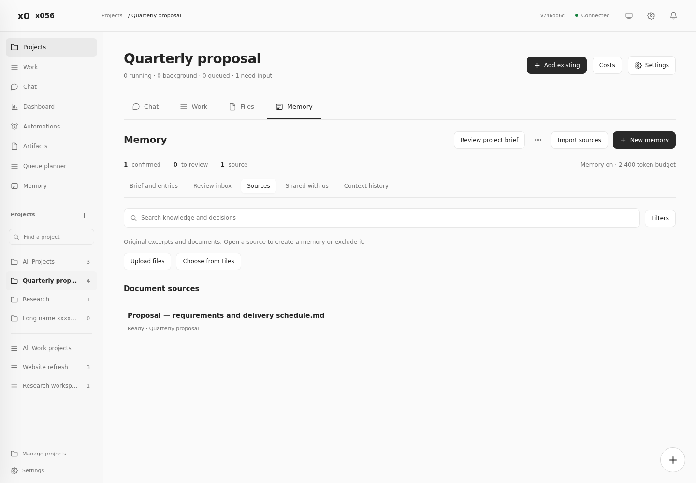
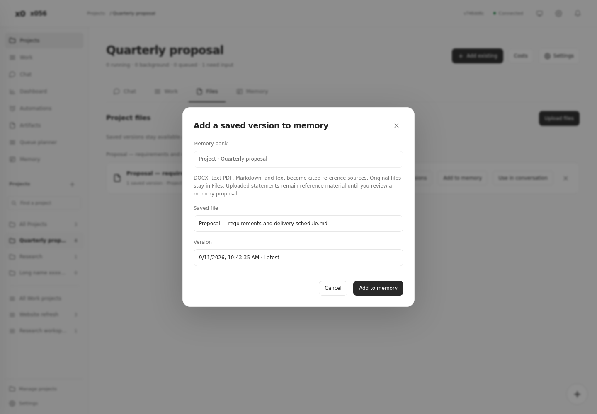
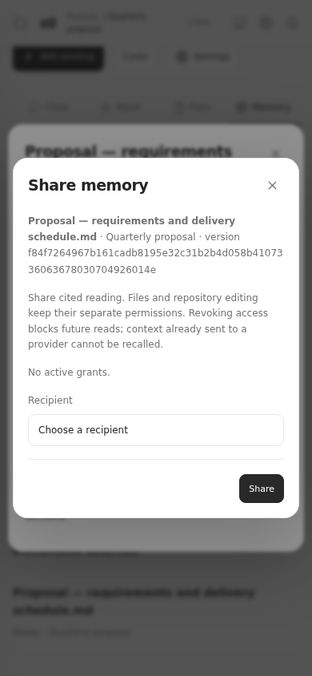
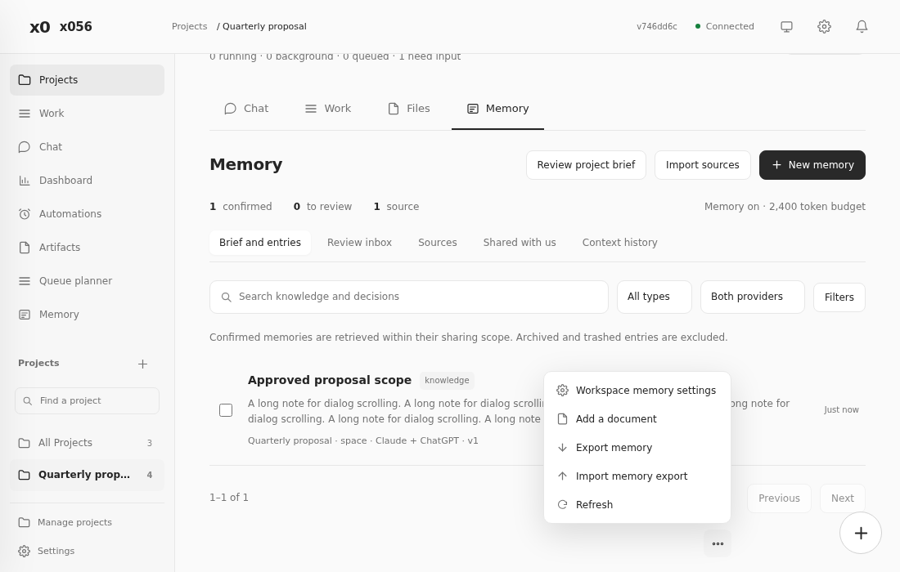

**Project integration audit · 11 September 2026**

The audit found two security bugs and several UI and flow defects. The fixes remain on `feature/project-integration`. Project spaces remain disabled by default. This audit does not deploy the feature.

The review covered the implementation at `746dd6c`, then checked the fixes against the existing panel. All browser work used isolated state, fake accounts, and fake providers. Production conversations and deployment settings were untouched.

| Area | Confirmed problem | Fix |
|---|---|---|
| Settings integrity | An authenticated settings request could overwrite internal IDs or archive state without the archive review. | Reject fields outside the editable settings list. Tests verify rejection leaves state unchanged. |
| Memory access | Supplying only half of a conversation identity fell back to the operator library. | Reject incomplete caller identities. Conversation reads retain their scope and provider checks. |
| Delayed responses | An old membership preview could enable Apply after the destination changed. Memory selections could also load for an earlier target. | Discard outdated responses. Bind reference changes to the loaded conversation and block conflicting edits during saving. |
| Popup behavior | A menu near the viewport edge could overlap its trigger. Escape closed the enclosing memory dialog. | Position menus above when needed. Keep them in the browser top layer. Escape closes the menu first and restores focus. |
| Project context | Embedded Memory changed the active sidebar section and repeated the page background and height. Counts described the whole workspace. | Retain Project navigation, use content height, and count the selected bank. Bank changes use Project links or the workspace Memory page. |
| File and source flow | Indexed documents appeared above a false empty state. Pagination included hidden document rows. Empty file banks allowed submission. | Separate document and excerpt results before pagination. Show accurate empty states and disable invalid file submission. |
| Sharing | The recipient list defaulted to the source owner. Long source version IDs overflowed mobile dialogs. | Require a recipient choice, omit the owner, and wrap long text. |
| Visual consistency | Project dialogs inherited a 510px cap. Saved-file fields lacked vertical spacing. New memory actions overflowed narrow dialogs. | Use the intended 700px dialog width, shared controls, consistent field gaps, and wrapping action rows. |

Security checks cover unauthenticated access, note grants versus original sources, grant revocation, protected downloads, and denied shared-file checkout. Existing checks cover membership fencing, queued reviews, extraction limits, source versions, and recovery.

RC still uses its existing trusted operator credential. These changes enforce conversation scope in supported API and MCP flows. They do not create isolated tenants or restrict a process that already holds the operator credential and filesystem access. This was a source review and regression audit, not an external penetration test.

Validation passed: 924 tests across 85 files, TypeScript checks, 10 document checks, and 12 browser workflows. The browser workflows reported no JavaScript errors. Syntax and diff checks also passed. The running panel still uses `/app/server/public/panel.html`, outside the edited workspace assets.

The new regression checks are `test/project-audit-api.test.ts` and `test/browser/project-integration-audit.cjs`. The browser runner includes the audit workflow. It checks widths of 320, 390, 768, 1024, and 1440 pixels, nested dialogs, focus, long names, and delayed responses.

