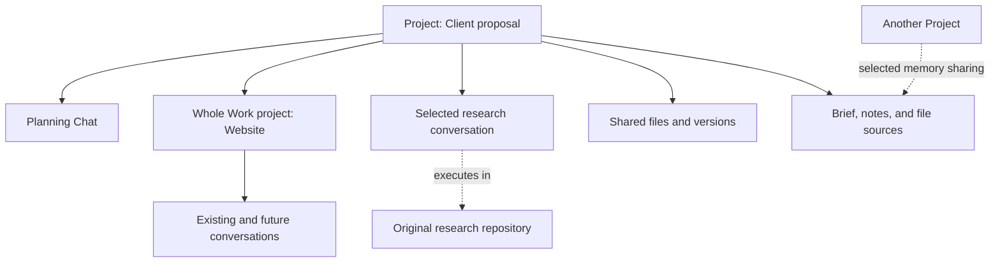
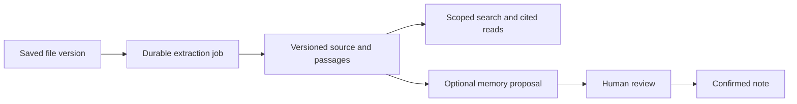

# Project integration and file memory blueprint

Draft for review · 11 September 2026 · Code baseline: `492dc57`, branch `feature/project-spaces`

**Make Project an organizing layer over existing Chat and Work identities.** A Project can include whole Work projects, individual Work conversations, and Chats. Its memory bank supports reviewed notes, file sources, and selected cross-project sharing.

This document plans changes to the first Project spaces build. It authorizes no implementation or deployment. It supersedes the earlier plan's one-workspace parent model. File integrity, account continuity, reviewed memory, and recovery requirements from that plan still apply.

## 1. Product blueprint

| Requirement | Proposed experience |
| --- | --- |
| Existing git-based Work | Keep the repository, directory, conversations, provider sessions, and execution controls. Add associations to the new Project. |
| Add existing | Choose Chat, Work conversation, or whole Work project. Preview the effect before applying it. |
| Whole Work project | Include current and future conversations, with visible exceptions for conversations assigned elsewhere. |
| Cross-project memory | Search other Projects, reference a selected revision, or share selected notes and sources for future retrieval. |
| Files in memory | Upload or choose a saved file, index its contents, and retrieve cited passages from Chat or Work. |

The example below uses one Project for a client proposal. The website repository remains an independent Work project.

Recommended defaults for review: one primary Project per conversation; optional references from other Projects; whole-work associations include future conversations. Individual assignments override the Work project's default. Existing Work projects remain accessible through `/work`, even without a Project association.

## 2. Separate organization from execution

Use `ProjectSpace` internally for the new Project. Keep `ProjectRegistry` as the existing execution registry. A Space has no execution directory and cannot launch a CLI by itself.

| Identity | Owns | Must remain stable |
| --- | --- | --- |
| ProjectSpace | Name, brief, shared files, memberships, defaults, required tools | New namespaced `spaceId`, revisions |
| Work project | Workspace and its Work conversations | Existing `projectId`, cwd, repository/worktree |
| Work conversation | Provider session and execution selections | Existing `(projectId, sessionId)` |
| Chat | Managed directory and its conversation | Existing Chat ID, session, files, drafts |

Add a durable `project-spaces.json` registry. Store Spaces, memberships, reference links, migration aliases, and operation receipts together. Reuse atomic replacement and fsync. Keep a registry revision for conflicting edits and a context revision for changes affecting execution.

Membership records need explicit types:

- Work project default: `workProjectId → spaceId`, or unassigned.
- Work conversation override: `(projectId, sessionId) → inherit | spaceId | standalone`.
- Chat assignment: `chatId → spaceId | standalone`.
- Reference: `spaceId → typed target`, with no automatic context inheritance.

The explicit `standalone` override prevents a removed conversation from immediately inheriting its Work project's association again. Removing an override means “Use Work project's Project”; removing membership means “Standalone.” Show these as separate actions.

Resolve one effective primary Project per execution. An archived primary Project blocks affected dispatch until restore or reviewed detachment; it must not silently become standalone. References do not change cwd, accounts, context, or file write access.

Do not overload existing MCP `projectId` arguments with Space IDs. Add `spaceId`, `workProjectId`, and typed owner fields where required. Old file URLs, conversation links, routing keys, queues, and transcripts keep their execution identities.

## 3. Adding existing work

**Add existing** offers searchable Chat, Work conversation, and Work project tabs. Conversation results group by their original Work project. Rows show their current primary Project, running state, and whether membership is inherited or overridden.

| Operation | Membership effect | Behavior to preserve |
| --- | --- | --- |
| Add Chat | Set its primary Project | Private memory, files, drafts, provider history |
| Add one Work conversation | Set an explicit override | Original cwd and provider session; sibling conversations unchanged |
| Add whole Work project | Change its default association | Current and future inherited conversations; explicit overrides retained |
| Add as reference | Create a navigation/source reference | No change to primary context or totals |
| Create Project from Work project | Create a Space and associate the selected Work project | No repository copy or session recreation |

For whole-work additions, preview included conversations and retained exceptions. Offer a separate reviewed action to include exceptions. A Work project already associated elsewhere requires a visible move or reference choice.

Bulk mutations must carry an operation ID, expected revisions, and a reviewed impact snapshot. Include active/background runs, queues, approvals, automations, inherited memory, and file access changes. Reject changes while affected execution is active. Unaffected siblings remain usable.

Persist the intended membership and recovery receipt atomically. Before publishing completion, pause affected future dispatch, mark queued messages for context review, and invalidate affected write leases. Reconcile unfinished receipts before accepting dispatch after restart.

Generalize today's pause helper from project IDs to exact `(projectId, sessionId)` targets. A single Work conversation move must not pause its entire repository. Schedules without a fixed session require explicit review because their eventual target may change. Preserve schedule IDs, timing, queue order, approvals, and delivery receipts.

Protect preview/apply against new conversations and interactive adoption. Track execution-topology revisions and serialize membership changes with conversation creation and dispatch admission. If affected membership changes after preview, return a conflict. Future conversations inherit only a completed association.

Detachment does not erase memory already injected into provider history. Show that fact and retain the option to start a fresh linked conversation.

## 4. UI, routes, and defaults

Keep the existing visual system and **Chat / Work / Files / Memory** tabs. The Project header adds **Add existing**. The Work tab groups whole Work projects and individually added conversations by repository. It shows “Uses Project …” on exceptions.

New Work asks for a target Work project when several are available. A default can preselect it, but the chosen repository remains visible. With none available, offer “Add Work project” or workspace setup. Never use the gateway directory as a fallback.

Keep `/projects/:spaceId/:tab`, `/chat/:chatId`, and `/work/:projectId/:sessionId` as anchors. Add a Work-project overview route if needed. A referring Project may appear in navigation breadcrumbs, but it cannot override the conversation's primary context. Refresh, sign-in, Back/Forward, notifications, and new tabs must resolve the same execution.

Chat remains available without a Project. `/work` continues to show all original Work projects. Do not create Spaces automatically from repository names during startup. Preserve draft/upload keys by conversation identity.

Existing conversations keep their provider, model, effort, and account choices. For new Work, use explicit choices, then Space mode defaults, then Work defaults, then provider defaults. Standalone creation uses its existing defaults. Project membership never changes an account lock.

Effective tool requirements combine conversation requirements, original Work requirements, and primary Space requirements. Chat combines its own requirements with its Space's. Discover plugins, MCP, and skills using the actual execution directory/account. Detect incompatible requirement fingerprints before dispatch and failover; retain queued work when requirements cannot be met.

## 5. Memory ownership and cross-project references

Reuse `memory.sqlite`, existing review history, source versions, exclusions, and retrieval. Extend ownership explicitly for Space memory. Preserve legacy `projectId` and `sharedProjectIds` meanings as execution identities; add typed Space ownership and sharing recipients.

Add explicit Space scope/owner fields to notes, sources, exclusions, exports, and import validation. Store new typed sharing grants in the same database. Read legacy execution recipients through a compatibility adapter; do not reinterpret them as Space recipients. Keep conversation preferences keyed by their original execution/session pair.

| Memory origin | Automatic eligibility |
| --- | --- |
| Conversation | That conversation only |
| Original Work project | Its existing Work conversations, even when assigned to different Spaces |
| Chat-local memory | That Chat only |
| Primary Space | Its effective primary member conversations |
| Shared note/source | Named recipients, subject to retrieval settings and exclusions |
| Global memory | Existing global settings |

Adding one Work conversation must not expose the repository's memory or sibling transcripts to every Chat in its destination Space. Adding a whole Work project also does not promote repository notes automatically. Provide a separate **Share with Project** action.

Extend the context resolver to return execution identity, original Work scope, primary Space, membership revision, and sharing dependencies. Use it for preview, dispatch, MCP reads, source search, attachments, and handoffs. A Space source view must filter exact conversation membership; collecting every source by Work project ID would expose excluded siblings.

Memory offers **Search other Projects**, **Use in this conversation**, and **Share with Projects**. Keep the operator's library browsing separate from agent retrieval eligibility. Agents can search approved eligible shared memory across Projects; a target ID alone cannot grant access.

Sharing needs a typed recipient and permissions to retrieve the selected note or source. It does not grant access to unrelated files, repository directories, or file editing. Show owner, source, revision, recipients, and revoke controls. Revocation prevents future retrieval, including through stale caches and queued references.

A shared note may expose its approved text without granting its entire source document. Show unavailable source evidence accurately. Retain dependency metadata on derived proposals; do not automatically turn shared passages into local confirmed notes.

An explicit reference pins an entry revision or source version for a turn. If automatic cross-project retrieval is disabled, show “Allow this reference for this turn.” Record that deliberate exception. It does not override an excluded source, unconfirmed note, unavailable provider, or disabled memory. Agents cannot create this exception themselves.

Bind the exception to the execution, logical message request ID, and exact selected revision. Queueing and failover preserve it within that turn. Removing the reference or revoking its grant invalidates future dispatch of that selection.

Apply eligibility before ranking and pagination. Keep exclusions before pins and one automatic context budget across notes and source passages. Retain the current 2,400-token default and 12-item cap across both; document any later tuning. Explain omitted material instead of silently injecting entire documents.

Capture exact note revisions, source versions, locators, membership, and grants at dispatch. Same-provider failover retains that snapshot while its grants remain valid. Revocation blocks new reads and pauses failover that would resend revoked material. Require a reviewed continuation instead of silently changing the snapshot. Previously sent provider context cannot be recalled. Later tool reads record their own source/version audit.

## 6. Files as memory sources

Memory gets **Brief and entries / Sources / Shared with us** views. Sources offers **Upload files** and **Choose from Project Files**. Files also gets **Add to memory** for a selected saved version.

Use the existing file catalog for original bytes and downloads. Reuse `KnowledgeSource.kind = document`, source revisions, and review proposals. Add persistent extraction jobs and passage indexing inside the existing memory store, not a second memory service.

| Record | Required fields |
| --- | --- |
| Document source | Typed owner, file/version ID, source ID, enabled state, sharing revision |
| Extraction | Blob hash, extractor/version/options, job state, attempt, progress, error, limits |
| Source version | Immutable file version, extraction identity, content hash, format, coverage |
| Passage | Source version, stable locator, text/hash, ordinal, estimated tokens |
| Citation | Source/version ID, passage or locator, file/version ID, original execution provenance |

Deduplicate extraction by immutable bytes and extractor configuration. Keep separate source identities and sharing rules for each owner. Identical bytes must not broaden access. Apply scope checks to cached output, search hits, citations, and downloads.

Document source versions must distinguish file-version and extractor changes even when extracted text is identical. Today's `ingest()` returns early for an unchanged content hash. Extend that behavior so revised provenance and locators persist without breaking existing source IDs.

Start with DOCX, text-based PDF, Markdown, and text. DOCX citations use headings, paragraphs, and table cells; PDF citations use pages. Use DOCX page numbers only when tied to a retained rendering. Scanned PDFs report “Needs OCR” when no verified OCR tool is configured. Other formats remain downloadable with an explicit indexing status.

Show `queued`, `processing`, `ready`, `partial`, `failed`, `unsupported`, and `needs OCR`. Support cancellation, retry, and restart recovery. Stale workers cannot publish after a source is removed or its chosen version changes. An empty extraction must never show Ready.

Reuse the 50 MiB file and 200 MiB batch upload limits. Add separate extraction limits for pages, expanded bytes, text, CPU time, and memory. Exceeding a limit produces a visible partial/failure result with retained downloads. Parser jobs must not execute macros, embedded programs, or external document links.

Index passages with SQLite FTS first. Keep passage size and overlap configurable; test retrieval across headings, tables, and chunk boundaries. Return locators with every passage. Large documents must not be silently cut to the current single-source content limit. Store full extracted coverage in passage rows; keep the source's summary bounded.

Manual addition enables the document as reference material. It does not confirm every statement as a fact. Agent-generated notes remain proposals. Manual note edits retain the existing operator confirmation behavior.

Default to a pinned file version. When a newer file version appears, show **Update source** and process it before switching the active source version. Keep old citations resolvable for authorized history inspection. Derived notes become “Source changed; review required,” preserving the existing stale-source rule.

Removing a source disables future retrieval while retaining the original file and citation history. Removing a file from the ordinary Files listing must disclose active memory sources; it must not destroy referenced bytes. Cross-project source sharing allows cited reading, not writable checkouts. Editing requires a separately authorized file copy or primary Space membership.

## 7. Contracts and integration changes

The following names are proposed contracts, not implemented endpoints.

| Contract | Purpose |
| --- | --- |
| Space list/detail | Spaces with effective members, Work groups, references, activity, and revisions |
| Membership preview/apply/status | Typed target, desired association, expected topology/context revisions, impact, operation receipt |
| Execution context | Original Work scope, primary Space, inherited notes/tools/files, and exclusion reasons |
| Memory sharing/reference | Typed subject/recipient, revision, grant/revoke, pinned turn reference |
| Source create/update/jobs | Upload or saved version registration, extraction progress, cancellation, retry |
| Source search/read | Eligible passages and bounded reads with exact citations |

Keep `/api/projects` and existing MCP execution parameters compatible. Version the aggregate Space contract. Extend memory and file tool schemas/output contracts together. Add source search/read tools for agents and proposal-based source registration if needed; agents cannot confirm notes or grant themselves cross-project access.

Generalize file owners to typed Chat, Work, and Space owners without rewriting existing file/version IDs. Keep old owner IDs as validated aliases. Add Space membership/context revision to per-execution leases. Re-check access before dispatch and before/after asynchronous commit preparation. A moved conversation cannot save into its former Space; unaffected siblings retain valid leases.

Chat-to-Work handoffs must select an actual target Work project. Persist that target, Space, choices, brief, exact references, and membership snapshot before creation. New Work inside a differently associated repository receives an explicit conversation override. Retry reuses one target and one initial delivery. Existing messaging approval and hop limits remain intact.

Activity and costs aggregate unique effective primary members. Reference rows show their own status but stay outside Project totals. Label costs as conversation lifetime totals under current membership; preserve original usage records and global totals. New dispatch records retain Space attribution for later historical reporting.

Archiving a Space pauses only its effective primary members. Archiving an original Work project blocks its own executions wherever they appear. References alone cannot pause another Project. Restore never resumes queued work automatically. Deletion must not orphan associated executions, memory, files, or citations.

## 8. Migration and recovery

The current build is undeployed and disabled by default. Its baseline passed 866 tests, typecheck, document checks, and browser workflows. Those results do not validate this revised design.

Handle both starting states explicitly:

| Starting state | Migration rule |
| --- | --- |
| Existing production Work/Chat | Preserve execution IDs and memory scopes. Start with unassigned associations; the operator explicitly adds work or creates a Project from it. |
| First-build Space data | Produce a reviewed mapping from old parent IDs to new Space IDs. Preserve aliases, member Chats, shared files, defaults, and operation history. |

An empty first-build Space becomes a Space without a Work project. Keep real Work records as executions. Validate mixed states explicitly; a schema version alone does not prove that every ordinary record was intentionally created as a Space.

The first build mixed repository memory and Space memory under one owner ID. For state containing such writes, report ambiguous ownership. Require a reviewed mapping; do not infer from titles or timestamps. Preserve old revision/source identities through ownership metadata or aliases. Do not copy every repository note into Space memory.

Use additive schemas and a durable migration journal. Validate and reconcile membership, file ownership, memory grants, source jobs, queues, and pending handoffs before dispatch. Pin old in-flight operations to their recorded identities; never reinterpret them through a new default. Rerunning migration must not duplicate Spaces, sources, or deliveries.

Extend the recovery inventory with `project-spaces.json`, migration receipts, extraction state, and retained extraction outputs. Back up the existing SQLite databases through the backup API with WAL pages. Rehearse restore after new memberships, source versions, grants, notes, file edits, and queued messages exist.

Feature disable must preserve those writes and existing execution access. Pause inherited-context queues for review; stop automatic source retrieval and fence Space write leases. Prefer compatible code with the feature disabled. An older binary cannot be assumed to understand new schemas.

Keep production assets baked into the image. Use isolated state for testing. Implementation approval and production deployment are separate future actions; this blueprint requests neither.

## 9. Build order and exit gates

| Stage | Main code areas | Exit gate |
| --- | --- | --- |
| 1. Contracts and migration | `projects.ts`, new Space registry, `project-context.ts`, recovery helper | Identity, alias, membership precedence, and both migration paths pass |
| 2. Membership and dispatch | Manager, queues, cron, approvals, capability routing, file leases | Exact-session moves, bulk races, restart reconciliation, and unaffected siblings pass |
| 3. Integration UI | `project-spaces.*`, `control-room.js`, `rc-chat.js`, handoffs | Add existing flows, repository choice, overrides, references, and stable routes pass |
| 4. Memory scope and sharing | Memory store/controller/sources, context builder, MCP | Work-local isolation, Space inheritance, grants, revocation, and explicit references pass |
| 5. File sources | File catalog, document worker, memory passages/jobs, source UI/tools | Real document ingestion, cited retrieval, version updates, limits, and restart pass |
| 6. Release preparation | Aggregation, source citations, recovery, browser/provider checks | Full acceptance matrix, tests, typecheck, backup/rollback evidence, reviewable build |

Stages 4 and 5 share one eligibility contract. Do not enable uploaded-source retrieval before its scope and grant checks pass. Keep the revised hierarchy behind `X056_PROJECT_SPACES_ENABLED` throughout implementation.

## 10. Acceptance matrix

| # | Scenario | Required evidence |
| --- | --- | --- |
| 1 | Legacy Work resumes | Same cwd, git/worktree, session/provider IDs, history, account lock, and selections |
| 2 | Whole Work association | Existing and future conversations appear; overrides remain visible |
| 3 | Individual Work association | Selected conversation changes primary context; siblings and repository stay unchanged |
| 4 | Chat association | Private memory/files, drafts, uploads, history, and URLs survive |
| 5 | Override removal | Inherit and Standalone behave differently; no accidental reassignment |
| 6 | Secondary reference | Same conversation opens; no automatic memory, write access, or duplicate totals |
| 7 | Bulk race | New/adopted conversation or changed membership invalidates stale preview |
| 8 | Interrupted membership | Restart completes receipts before dispatch; no duplicate mutation |
| 9 | Queues and automations | Exact targets pause and require review; ordering, timing, approvals, and retries survive |
| 10 | Multi-repository Work | Explicit/default repository selection launches only in the chosen cwd |
| 11 | Defaults and tools | Existing selections stay fixed; actual cwd/account determine plugin/MCP/skill eligibility |
| 12 | Local memory isolation | Work-local and Chat-local notes never spread through association alone |
| 13 | Cross-project retrieval | Approved shared notes/sources are searchable; unrelated/proposed/excluded data stays out |
| 14 | Reference with retrieval off | Deliberate turn exception works without changing global settings or bypassing exclusions |
| 15 | Revocation | Cached results, new reads, queued references, and citations enforce current access |
| 16 | Preview and failover | One budget; exact revisions and membership survive account failover without reselection |
| 17 | Document upload | DOCX/PDF/Markdown/text become cited sources; original bytes and downloads stay intact |
| 18 | Document coverage | Tables and chunk boundaries retrieve correctly; scans/limits/empty extraction report accurate status |
| 19 | Source restart/update | Cancel/retry/restart and stale-worker rejection preserve the chosen active version |
| 20 | File/reference ownership | Cross-project source reads cannot commit edits; copying creates independent history |
| 21 | Shared-file concurrency | A moved or failed execution loses its lease; sibling leases remain valid; conflicting edits fail |
| 22 | Derived memory | Upload alone confirms no facts; changed sources require review without losing old citations |
| 23 | Handoffs/messaging | Exact repository/Space target; one creation/delivery; existing approvals and hop limits pass |
| 24 | Navigation/mobile | Links, history, refresh, sign-in, notifications, focus, and mobile layouts preserve identity |
| 25 | Archive and aggregation | Only primary members pause/count; referenced work remains independent; restore is deliberate |
| 26 | Both migrations and rollback | Legacy and first-build fixtures retain all IDs/bytes; later writes survive compatible disable and snapshot restoration |

Run `npm test` and `npm run typecheck` after implementation. Extend the existing Project/Chat browser and document fixtures rather than replacing their coverage. Test both providers and simulated account limits, then record any remaining live-provider verification separately. Do not create production test conversations without authorization.

## 11. Re-check record and boundaries

The first pass mapped these requirements onto registry, context, file leases, memory source indexing, and handoff code at `492dc57`. It identified the current one-workspace assumption and missing document ingestion workflow.

The second pass checked membership precedence, per-session pauses, future conversation races, typed identity compatibility, source access, and both migration paths. It added explicit Standalone overrides, sessionless schedule review, and exact member-source filtering. It also covered legacy shared recipients, unchanged-text source updates, and revoked grants during failover. Sections 3, 5, 6, and 8 record those constraints; the acceptance matrix covers them.

This revision supports multiple existing Work projects per Space. Moving repository directories, merging provider transcripts, multi-user permissions, automatic Desktop import, and a second task system remain outside scope. Semantic/vector search and unconfigured OCR are later extensions. File sources remain reference data; current user instructions take precedence.

References: [first-build review](https://x056.think.val.id/project-spaces-build-review-20260911.md), [earlier implementation plan](https://x056.think.val.id/rc-project-chat-work-memory-plan-20260911.md), [recovery runbook](https://x056.think.val.id/project-spaces-recovery-20260911.md).
