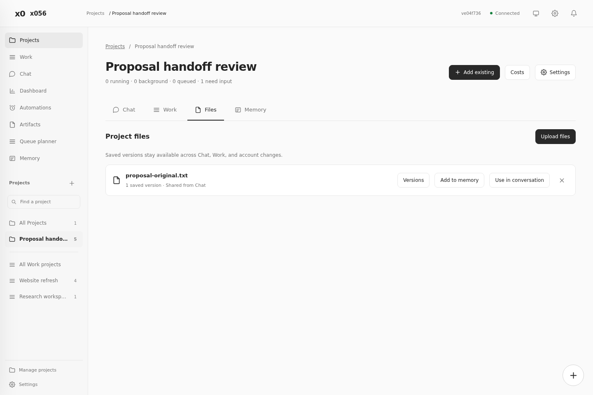
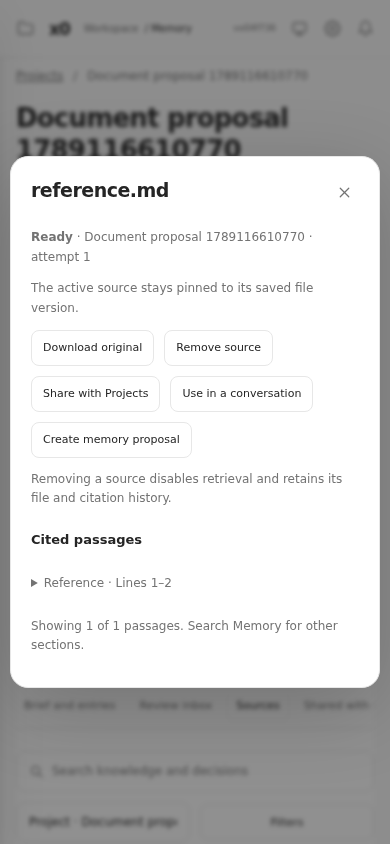

# Project integration: implementation review

The Project integration blueprint is implemented on `feature/project-integration`. Stages 0 through 6 cover existing Work integration, Chat, shared files, reviewed memory, document sources, and recovery.

The build remains disabled by default through `X056_PROJECT_SPACES_ENABLED`. This implementation did not deploy production or change its panel assets. Review and production deployment remain separate.

## What is ready

| Area | Result |
| --- | --- |
| Existing Work | Associate a whole repository or selected conversations. Original cwd, session IDs, provider history, and account selections stay intact. |
| Project navigation | Chat, Work, Files, and Memory tabs use direct links. Work groups show inherited membership and explicit exceptions. |
| Memory | Private conversation, Work, Chat, and Project scopes remain distinct. Share selected notes or sources with typed recipients. |
| References | Pin exact revisions to a message. Queueing and account retries retain the selection. Revocation blocks further retrieval. |
| File sources | Upload or select saved DOCX, PDF, Markdown, and text versions. Retrieve cited passages without replacing original bytes. |
| Files | Version history, downloads, working copies, conflict checks, and per-execution leases protect shared edits. |
| Tools | Provider, model, effort, account, plugins, MCP, and skills use the actual execution directory and account. |
| Recovery | Reviewed migration, file aliases, durable receipts, WAL backups, compatible disable, and explicit queue review preserve later writes. |

## Validation

The final full run passed **920 tests across 84 files**. Typecheck passed. All 10 Python document checks passed, including actual DOCX structures and PDF extraction.

Browser checks use a fresh gateway and temporary state for each workflow. The original Project, Chat, navigation, memory, and file workflows remain covered. New workflows check memberships, references, repository selection, handoffs, source uploads, citations, grants, mobile layouts, and feature disable. They collect JavaScript errors and fail if any occur.

The recovery rehearsal backed up later document versions, grants, references, notes, files, and queued messages. Restoration preserved IDs and original bytes. It rejected stale write leases and retained a separate snapshot of newer writes. A damaged grant prevented dispatch until repair.

Provider fixtures cover Claude and Codex, simulated limits, retries, and account changes. These results do not claim a live-provider run or a production swap.

## Source behavior and limits

Files stay pinned to a saved version. Update source processes the next version before replacing the active one. Old citations still identify their original version. Sharing a source allows cited reading; it grants no writable checkout.

Notes and source passages share the existing 2,400-token default and 12-item cap. Upload limits remain 50 MiB per file and 200 MiB per batch. Extraction limits separately bound pages, expanded bytes, text, time, and memory. Empty or incomplete extraction reports its actual status. Scanned PDFs report Needs OCR when no verified OCR tool is configured.

Uploading a source creates reference material. It does not confirm its statements as facts. Derived notes enter review, and source updates flag existing notes for review.

## Before a production release

Use the [recovery runbook](https://x056.think.val.id/project-integration-recovery-20260911.md) to inspect the target state and take a consistent backup. First-build Space records require reviewed ownership mappings; ordinary production Work and Chat start unassigned. Keep the panel and its assets baked into the same image.

Feature disable preserves saved data and original execution access. It pauses inherited-context queues and automations for review. The Planner supports review while disabled. Re-enabling the feature requires another review before retained work resumes.

The full [implementation record](2026-09-11-project-integration-build.md) maps the 26 blueprint acceptance gates to checked fixtures.
